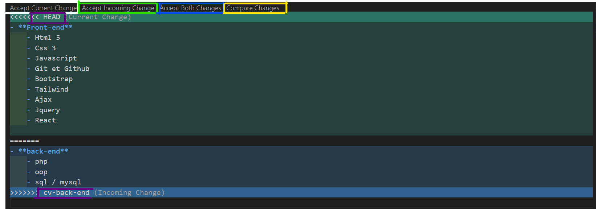

# lab-github

## Travail a faire

Dans ce projet, nous développerons un CV sur notre branche principale `(master)` GitHub, reflétant l'ensemble de nos compétences en langages de programmation. Pour une gestion efficace, nous créerons deux branches spécialisées : une axée sur les langages `front-end` et l'autre dédiée aux langages `back-end`.


## Critere de validation :

- creation des Branches.
- Résolution de Conflits.
- utilisation de merge.

___

## Solution

### creation des Branches :


```
git branch cv-front-end
```
Cette commande crée une nouvelle branche locale appelée "cv-front-end". Cependant, elle ne bascule pas automatiquement vers cette nouvelle branche.


```
git checkout cv-front-end
```
Cette commande permet de basculer vers la branche "cv-front-end". C'est ici que vous commencerez à effectuer vos modifications spécifiques au front-end du CV.


```
git branch
```
Cette commande affiche la liste de toutes les branches locales présentes dans votre dépôt Git. Vous verrez un astérisque (*) à côté de la branche actuelle.


```
git checkout -b cv-front-end
```
Ces deux commandes peuvent être combinées pour créer une nouvelle branche et basculer immédiatement vers elle. Remplacez "cv-front-end" par le nom que vous souhaitez donner à votre nouvelle branche.


```
git branch -m cvFrondEnd
```
Cette commande renomme la branche actuelle en "cvFrontEnd". Cela peut être utile si vous souhaitez modifier le nom de la branche après sa création.


```
git branch -d cvFrondEnd
```
Cette commande supprime la branche spécifiée. Assurez-vous d'être sur une autre branche avant de supprimer la branche actuelle.

### Résolution de Conflits :


Les conflits surviennent généralement dans Git lorsqu'il y a des modifications concurrentes dans le même fichier ou sur les mêmes lignes de code, entre la branche que vous essayez de fusionner et la branche dans laquelle vous fusionnez. 

**Comment les conflits se produisent-ils ?**

1. **Changements concurrents :** Deux personnes ou plus apportent des modifications à la même partie d'un fichier dans différentes branches.

1. **Fusion automatique impossible :** Lorsque Git ne peut pas fusionner automatiquement les modifications en raison de conflits entre les versions, il signale un conflit et marque les zones problématiques dans le fichier.

### utilisation de merge

Lorsque vous effectuez une fusion dans VS Code et qu'il y a des conflits, VS Code utilise l'éditeur intégré pour vous aider à résoudre ces conflits. Les options que vous pourriez voir dans cet éditeur incluent généralement :



1. **Accept Current Change :**
Cela correspond à la possibilité de conserver uniquement les modifications actuelles, celles de la branche dans laquelle vous effectuez la fusion.

1. **Accept Incoming Change :**
Cela correspond à la possibilité de conserver uniquement les modifications provenant de l'autre branche, celle que vous essayez de fusionner dans la branche actuelle.

1. **Accept Both Changes :**
Cela correspond à la possibilité de conserver les modifications des deux branches, combinant les changements conflictuels.

1. **Compare Changes :**
Cette option n'est généralement pas directement disponible dans l'éditeur de résolution de conflits de VS Code. Cependant, vous pouvez utiliser l'extension GitLens ou d'autres extensions pour obtenir une vue côte à côte des modifications dans les différentes branches.
___

## Références :


[À propos des branches](https://docs.github.com/fr/pull-requests/collaborating-with-pull-requests/proposing-changes-to-your-work-with-pull-requests/about-branches)

[Résolution d’un conflit de fusion en utilisant la ligne de commande](https://docs.github.com/fr/pull-requests/collaborating-with-pull-requests/addressing-merge-conflicts/resolving-a-merge-conflict-using-the-command-line?platform=windows)